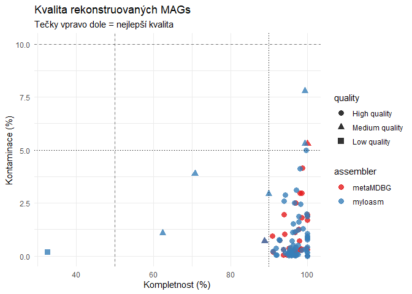

# Srovnání metagenomických asseblerů: metaMDBG vs myloasm
Karolína Šustrová
2026-02-01

# Úvod

Cílem této analýzy je porovnat výkon dvou metagenomických assemblerů,
**metaMDGB** a **myloasm**, na datech z mirkobiálního společenstva
horkého pramene. Srovnání je založeno na metadatech kontigů, odhadech
kompletnosti (CheckM2) a taxonomické klasifikaci (GTDB-Tk).

# Analýza

1.  Příprava prostředí a načtení knihoven

``` r
library(tidyverse)
library(stringr)
```

2.  Načtení a parsování hlaviček

``` r
# Funkce pro načtení raw hlaviček
read_headers <- function(file_path) {
  read_lines(file_path) %>%
    as_tibble() %>%
    rename(raw_header = value)
}

# A) Zpracování MetaMDBG
# formát: >ctg0 length=7710 coverage=2.25 circular=no
metamdbg_headers <- read_headers("metamdbg_assembly_headers.txt") %>%
  filter(str_detect(raw_header, "^>")) %>%
  mutate(
    assembler = "metaMDBG",
    # Extrakce ID (vše mezi > a mezerou)
    contig_id = str_extract(raw_header, "(?<=^>)[^\\s]+"),
    # Extrakce parametrů pomocí regexu
    length = as.numeric(str_extract(raw_header, "(?<=length=)\\d+")),
    coverage = as.numeric(str_extract(raw_header, "(?<=coverage=)[0-9.]+")),
    circular_status = str_extract(raw_header, "(?<=circular=)[a-z]+")
  ) %>%
  mutate(circular = if_else(circular_status == "yes", TRUE, FALSE)) %>%
  select(assembler, contig_id, length, coverage, circular)

# B) Zpracování Myloasm
# formát: >u384..._len-10849...mult=1.00
myloasm_headers <- read_headers("myloasm_assembly_headers.txt") %>%
  filter(str_detect(raw_header, "^>")) %>%
  mutate(
    assembler = "myloasm",
    # Nejprve celé ID
    full_id = str_extract(raw_header, "(?<=^>)[^\\s]+"),
    # Ořízneme na contig ID (vše od "_len-" dál)
    contig_id = str_remove(full_id, "_len-.*"),
    length = as.numeric(str_extract(raw_header, "(?<=_len-)\\d+")),
    coverage = as.numeric(str_extract(raw_header, "(?<=_depth-)[0-9.]+")),
    circular_raw = str_extract(raw_header, "(?<=_circular-)[^_]+")
  ) %>%
  # Zadání: consider possible circularity as full circularity
  mutate(circular = if_else(circular_raw %in% c("yes", "possible"), TRUE, FALSE)) %>%
  select(assembler, contig_id, length, coverage, circular)

# Spojení obou assemblerů
contigs_df <- bind_rows(metamdbg_headers, myloasm_headers)
```

3.  Načtení CheckM2 (Kvalita)

``` r
load_checkm <- function(path, assembler_name) {
  read_tsv(path, show_col_types = FALSE) %>%
    select(Name, Completeness, Contamination) %>%
    rename(contig_id = Name) %>%
    mutate(assembler_checkm = assembler_name)
}

checkm_meta <- load_checkm("quality_report_metamdbg.tsv", "metaMDBG")
checkm_mylo <- load_checkm("quality_report_myloasm.tsv", "myloasm")

quality_df <- bind_rows(checkm_meta, checkm_mylo)
```

4.  Načtení GTDB-Tk (Taxonomie)

``` r
load_gtdb <- function(path_bac, path_ar) {
  # Načteme bakterie, vybereme jen potřebné sloupce a přidáme doménu
  bac <- read_tsv(path_bac, show_col_types = FALSE) %>%
    select(user_genome, classification) %>%
    mutate(domain = "Bacteria")

  # To samé pro archeae
  ar <- read_tsv(path_ar, show_col_types = FALSE) %>%
    select(user_genome, classification) %>%
    mutate(domain = "Archaea")

  # Spojíme je dohromady
  bind_rows(bac, ar) %>%
    rename(contig_id = user_genome)
}

gtdb_meta <- load_gtdb("gtdbtk.bac120.summary_metamdbg.tsv", "gtdbtk.ar53.summary_metamdbg.tsv")
gtdb_mylo <- load_gtdb("gtdbtk.bac120.summary_myloasm.tsv", "gtdbtk.ar53.summary_myloasm.tsv")

taxonomy_df <- bind_rows(gtdb_meta, gtdb_mylo) %>%
  # Extrakce Phylum: hledáme vzor "p__" následovaný textem do dalšího středníku
  mutate(Phylum = str_extract(classification, "(?<=p__)[^;]+")) %>%
  mutate(Phylum = replace_na(Phylum, "Unclassified"))
```

5.  Finální spojení tabulek

``` r
final_df <- contigs_df %>%
  left_join(quality_df, by = "contig_id") %>%
  left_join(taxonomy_df, by = "contig_id")

# Kontrola
glimpse(final_df)
```

    Rows: 103,119
    Columns: 11
    $ assembler        <chr> "metaMDBG", "metaMDBG", "metaMDBG", "metaMDBG", "meta…
    $ contig_id        <chr> "ctg0", "ctg1", "ctg2", "ctg3", "ctg4", "ctg5", "ctg7…
    $ length           <dbl> 7710, 8229, 10850, 9023, 56052, 12495, 10877, 46710, …
    $ coverage         <dbl> 2.25, 1.96, 3.32, 4.85, 7.90, 2.07, 2.71, 5.03, 1.73,…
    $ circular         <lgl> FALSE, FALSE, FALSE, FALSE, FALSE, FALSE, FALSE, FALS…
    $ Completeness     <dbl> NA, NA, NA, NA, NA, NA, NA, NA, NA, NA, NA, NA, NA, N…
    $ Contamination    <dbl> NA, NA, NA, NA, NA, NA, NA, NA, NA, NA, NA, NA, NA, N…
    $ assembler_checkm <chr> NA, NA, NA, NA, NA, NA, NA, NA, NA, NA, NA, NA, NA, N…
    $ classification   <chr> NA, NA, NA, NA, NA, NA, NA, NA, NA, NA, NA, NA, NA, N…
    $ domain           <chr> NA, NA, NA, NA, NA, NA, NA, NA, NA, NA, NA, NA, NA, N…
    $ Phylum           <chr> NA, NA, NA, NA, NA, NA, NA, NA, NA, NA, NA, NA, NA, N…

6.  Korelace délky a pokrytí

``` r
ggplot(final_df, aes(x = length, y = coverage)) +
  geom_point(aes(color = circular), alpha = 0.5, size = 1) +
  geom_smooth(method = "lm", color = "black", linetype = "dashed", se = FALSE) +
  scale_x_log10(labels = scales::label_number(scale_cut = scales::cut_short_scale())) +
  scale_y_log10() +
  facet_wrap(~ assembler) +
  scale_color_manual(values = c("TRUE" = "firebrick", "FALSE" = "gray70")) +
  labs(
    title = "Vztah mezi délkou kontigu a pokrytím",
    subtitle = "Logaritmické osy x a y",
    x = "Délka (bp)",
    y = "Pokrytí (Coverage)",
    color = "Cirkulární"
  ) +
  theme_minimal()
```


7.  Kvalita a taxonomie MAGs

``` r
# Příprava dat pro MAGs
mags_df <- final_df %>%
  filter(length > 500000, circular == TRUE) %>%
  # Kategorizace kvality podle zadání
  mutate(quality = case_when(
    Completeness > 90 & Contamination < 5 ~ "High quality",
    Completeness > 50 & Contamination < 10 ~ "Medium quality",
    TRUE ~ "Low quality"
  )) %>%
  # Pořadí faktorů pro hezčí legendu
  mutate(quality = factor(quality, levels = c("High quality", "Medium quality", "Low quality")))

# Výpis počtu nalezených MAGs
mags_df %>% count(assembler, quality)
```

    # A tibble: 5 × 3
      assembler quality            n
      <chr>     <fct>          <int>
    1 metaMDBG  High quality      34
    2 metaMDBG  Medium quality     2
    3 myloasm   High quality      57
    4 myloasm   Medium quality     6
    5 myloasm   Low quality        1

``` r
# Vizualizace kvality (scatter plot)
ggplot(mags_df, aes(x = Completeness, y = Contamination)) +
  geom_point(aes(color = assembler, shape = quality), size = 3, alpha = 0.8) +
  # Prahové linie pro High quality (90% completeness, 5% contamination)
  geom_vline(xintercept = 90, linetype = "dotted") +
  geom_hline(yintercept = 5, linetype = "dotted") +
  # Prahové linie pro Medium quality (50% completeness, 10% contamination)
  geom_vline(xintercept = 50, linetype = "dashed", alpha = 0.5) +
  geom_hline(yintercept = 10, linetype = "dashed", alpha = 0.5) +
  scale_color_brewer(palette = "Set1") +
  labs(
    title = "Kvalita rekonstruovaných MAGs",
    subtitle = "Tečky vpravo dole = nejlepší kvalita",
    x = "Kompletnost (%)",
    y = "Kontaminace (%)"
  ) + 
  theme_minimal()
```



``` r
# Taxonomie podle kmenů
taxonomy_summary <- mags_df %>%
  filter(quality != "Low quality") %>%
  count(assembler, Phylum, quality)

ggplot(taxonomy_summary, aes(x = n, y = Phylum, fill = assembler)) +
  geom_col(position = "dodge") +
  facet_wrap(~ quality) +
  labs(
    title = "Počet rekonstruovaných MAGs podle kmene Phylum",
    subtitle = "Pouze High a Medium kvalita",
    x = "Počet MAGs",
    y = "Phylum"
  ) +
  theme_minimal() +
  theme(axis.text.y = element_text(size = 8))
```


# Závěr

V této analýze jsme porovnali dva metagenomické assemblery **mataMDBG**
a **myloasm** na základě schopnosti rekonstruovat cirkulární kontigy
delší než 500 kb z dat mikrobiálního společenstva horkého pramene.
Hodnotili jsme počet a kvalitu rekonstruovaných MAGs a jejich
taxonomickou diverzitu.

Z výsledků a grafů lze konstatovat:

1.  Počet MAGs: Assembler **myloasm** rekonstruoval více cirkulárních
    kontigů delších než 500 kb.

2.  Kvalita MAGs: A hlediska kvality byl assembler **myloasm**
    úspěšnější v produkci vysoce kvalitních MAGs (57) oproti metaMDBG
    (34).

3.  Taxonomická diverzita: Oba assemblery pokryly podobné taxonomické
    skupiny, ale **myloasm** vykázal větší diverzitu v rámci
    rekonstruovaných MAGs.

Pro tento typ dat se zdá být vhodnější assembler **myloasm**, který
poskytuje lepší výsledky jak v počtu, tak v kvalitě rekonstruovaných
genomů.
